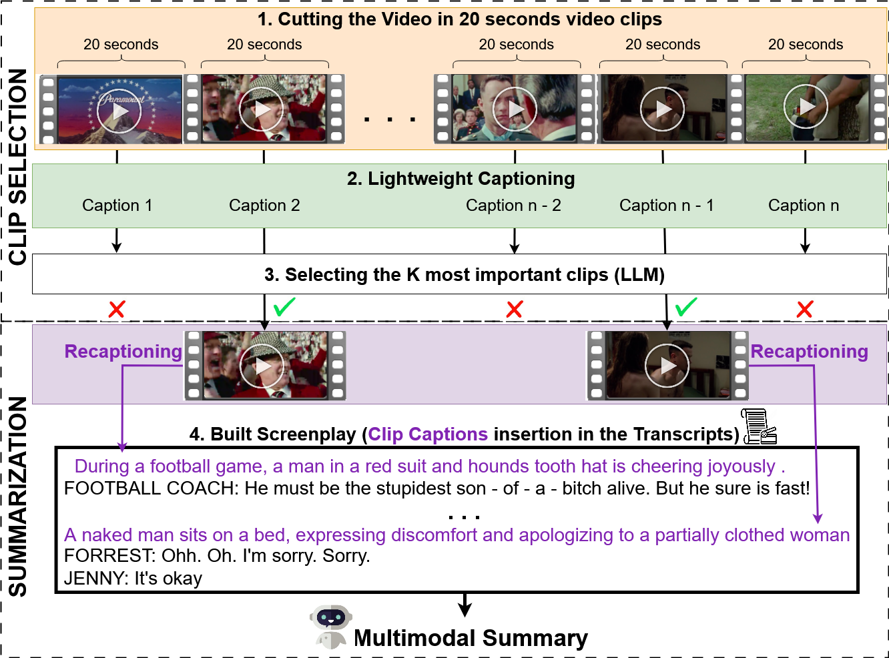
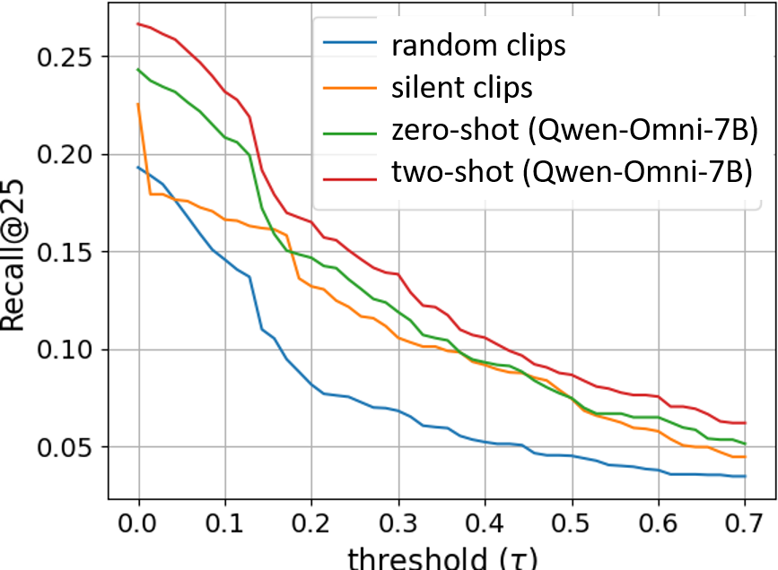
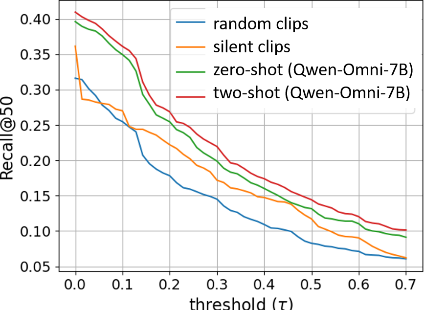
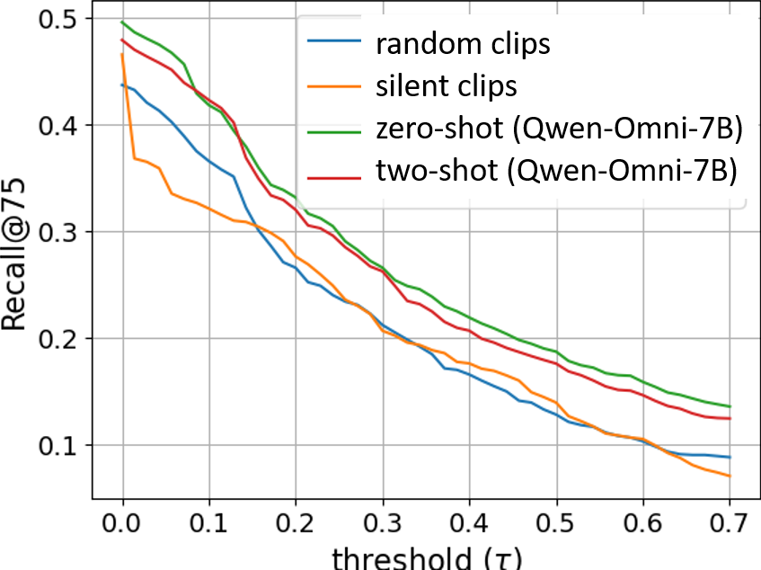
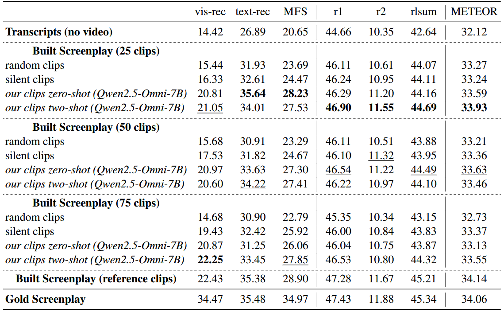

# [Minimal Clips, Maximum Salience: Long Video Summarization via Key Moment Extraction (IWSDS 2026)](https://aclanthology.org/2026.iwsds-1.22/)

[[📝 Paper]](https://aclanthology.org/2026.iwsds-1.22/) [[📚 Bibtex]](#citation)

_Galann Pennec, Zhengyuan Liu, Nicholas Asher, Philippe Muller, Nancy Chen_

**Here we provide code for our Video Clip Selection pipeline for Efficient Long Movie Summarization.**

**Description:** A lightweight and cost-effective framework for multimodal long-video summarization through LLM-guided clip selection.

<a id="pipeline-fig"></a>

<p align="center">

</p>

**Step-by-Step Approach ([Figure](#pipeline-fig)):**
1. We segment movie videos into short clips of `20` seconds.
2. We generate lightweight visual descriptions of those clips using an efficient VLM (`Qwen-2.5-Omni-{3,7}B`).
3. These captions are then analyzed by a Large Language Model (`Gemini-{2.5,1.5}-Flash` or `Qwen2.5-72B-Instruct`) to identify the most visually salient ones to build the multimodal summary.
4. [Optional] Recaptioning of only the selected clips using a more robust VLM (`Gemini-2.5-Flash-Lite`).
5. We build a screenplay-like document that combines the selected visual elements with aligned transcripts.
6. We summarize the built screenplays.

By focusing on only a small subset of highly relevant clips, our method preserves critical visual information while drastically reducing computational costs by only using a small ratio of the video in input (e.g. 10%) while achieving strong summarization performance on the [MovieSum](https://huggingface.co/datasets/rohitsaxena/MovieSum) benchmark (see [Table](#results-tab)).

We structure this repository as follows:
1. [Loading the Data](#loading-the-data)
2. [Preparing the Data](#preparing-the-data)
3. [Video Clip Selection](#video-clip-selection) using one of the implemented approaches ([Our Clip Selection](#our-clip-selection), [Random Clips](#random-clips) or [Silent Clips](#silent-clips))
4. [Screenplay Summarization](#screenplay-summarization)
5. [Evaluation](#evaluation)

## Installation
Install prerequisite packages with conda.
```
conda create -n minimal_clips python=3.12
conda activate minimal_clips
pip install -r requirements.txt
```

## Configure Paths
Update dataset, model, and API key locations in [`paths.py`](paths.py) before running the scripts.

## Loading the Data
Our experiments are made on the test split of the [MovieSum](https://huggingface.co/datasets/rohitsaxena/MovieSum) dataset made of 200 movies for evaluation.  
**1. Download the videos**  
Download the videos in .mp4 for all the movies on [MovieBox](http://moviebox.ph/)

**2. Extract the annotations in MovieSum test split**
```
python -m load_data.extract_annotated_data
```

## Preparing the Data
**1. Aligning Videos and Dialogues in Time**
```
python -m prepare_data.asr_transcripts
python -m prepare_data.align_vid_and_transcripts
python -m prepare_data.aligned_screenplays_from_aligned_transcripts
```

**2. Cutting the Videos in 20 seconds video clips**
```
python -m prepare_data.video_segmentation
```

## Video Clip Selection
We set the number of selected clips `--nb_clips` to `50` in what follows (other values studied in the paper: `25`, `75`).  
Choose one of the following Clip Selection approaches:

### Our Clip Selection
**1. Lightweight Captioning of all Video Clips**  
```
python -m clip_selection.ours.lightweight_captioning
```

**2. Clip Selection**  
Flags:
- `--few_shot_examples`: Indicates that few shot examples are being used by the clip selection method.
```
python -m clip_selection.ours.clip_selection --nb_clips 50 --few_shot_examples --api_key `YOUR_GOOGLE_API_KEY`
```

**3. [Optional] Recaptioning of the Selected Clips**
```
python -m summ.recaption_clips --clip_selection ours --nb_clips 50 --api_key `YOUR_GOOGLE_API_KEY`
```

### Random Clips
This baseline randomly selects `nb_clips` clips of 20 seconds from the whole video.  
**1. Random Clips Selection**
```
python -m clip_selection.random.random_clip_selection --nb_clips 50
```

**2. [Optional] Recaptioning of the Selected Clips**
```
python -m summ.recaption_clips --clip_selection random --nb_clips 50 --api_key `YOUR_GOOGLE_API_KEY`
```

### Silent Clips
This baseline considers all video clips that occur during a pause in the dialogue following the approach of (Pennec et al.,
2025) ([paper](https://aclanthology.org/2025.ijcnlp-long.129/)).  
Such clips are then sorted by decreasing duration and the `nb_clips` first are chosen.  
**1. Silent Clips Selection**
```
python -m clip_selection.silent.silent_clip_selection --nb_clips 50
```

**2. [Optional] Recaptioning of the Selected Clips**  
Flags:
- `--captioning_model`: the models used for recaptioning the silent clips (use `gemini-2.5-flash-lite` or `qwen_omni`)
```
python -m clip_selection.silent.extract_silent_clips --nb_clips 50
python -m clip_selection.silent.recaption_silent_clips --captioning_model gemini-2.5-flash-lite --api_key `YOUR_GOOGLE_API_KEY`
```

## Clip Selection Evaluation
**1. Clip Selection Reference**  
We automatically build a reference for the Clip Selection task given the existing annotations given in the `MovieSum` dataset.
```
python -m upperbound.groundtruth_visual_facts
```

**2. [Optional] Recaptioning of the Selected Clips**
```
python -m upperbound.extract_groundtruth_clips.py
python -m summ.recaption_clips --clip_selection upperbound --api_key `YOUR_GOOGLE_API_KEY`
```
**3. Clip Selection Evaluation against the Reference**  
By running the command below we are able to generate the following plots displaying the `Recall@K` for varying $\tau$.
- `K` is the number of selected clips
- $\tau$ is the threshold used for the matching of retrieved clips with the reference.  
```
python -m clip_selection.eval.plot_recall_at_k --K 50
```
<p align="center">
  
  
  
</p>


## Screenplay Summarization
**1. Build the Screenplays**  
Flags:
- `--clip_selection`: the clip selection algorithm used. Choose between `ours`, `random` or `silent`.
- `--nb_clips`: number `K` of selected clips by the method. Studied values in the paper: `25`, `50` and `75`.
Optional flags:
- `--recaptioning`: Indicates whether recaptioning of the selected clips is being performed
- `--few_shot_examples`: Indicates that few shot examples are being used by the clip selection method.
```
python -m summ.build_generated_screenplay --clip_selection ours --nb_clips 50 --recaptioning --few_shot_examples
```

**2. Summarize the Screenplays**  
Flags:
- `--path`: directory path to the built screenplays in the previous step
- `--version`: summarization model. Choose between `gemini-2.5-flash`, `gemini-1.5-flash` or `qwen2-72b-instruct`
- `--api_key`: the `GOOGLE_API_KEY`
- `--nb_words`: in all our experiments we set the summary length to 1000 words.
```
python -m summ.summarize_screenplay --version gemini-2.5-flash --api_key `YOUR_GOOGLE_API_KEY` --path `built_screenplays_dir` --nb_words 1000
```

## [Optional] Screenplay of Reference Clips
**1. Build the Screenplay of Reference Clips**
```
python -m summ.upperbound.screenplay_upperbound_clips
```

**2. Summarize the Screenplay of Reference Clips**
```
python -m summ.summarize_screenplay --version gemini-2.5-flash --api_key `YOUR_GOOGLE_API_KEY` --path `reference_screenplays_dir` --nb_words 1000
```

## Evaluation
**1. Evaluation on Traditional Metrics (ROUGE and METEOR)**  
Flags:
- `--expname`: directory path to the generated summaries.
- `--truncate_length`: in our metrics computations, we always truncate the summaries to 1000 words.
```
python -m summ.eval.traditional_metrics --truncate_length 1000 --expname `summmary_dir`
```

**2. Evaluation on Multimodal Metrics ([MFactSum](https://aclanthology.org/2025.ijcnlp-long.129/))**
```
python -m summ.eval.MFactSum_fact_eval --truncate_length 1000 --expname `summmary_dir` --api_key `YOUR_GOOGLE_API_KEY`
```

<a id="results-tab"></a>

<p align="center">

</p>

**Table: Summarization results on the MovieSum test set using Gemini 2.5 Flash as the summarization model. We report visual recall (vis-rec), textual recall (text-rec), and MFactSum (MFS), as well as ROUGE-1 (R1), ROUGE-2 (R2), ROUGE-Lsum (RLSum), and METEOR. Best results are highlighted in bold.**

## Citation
If you find this project useful in your research, please consider citing:
```
@misc{pennec2026minimalclipsmaximumsalience,
      title={Minimal Clips, Maximum Salience: Long Video Summarization via Key Moment Extraction}, 
      author={Galann Pennec and Zhengyuan Liu and Nicholas Asher and Philippe Muller and Nancy F. Chen},
      year={2026},
      eprint={2512.11399},
      archivePrefix={arXiv},
      url={https://arxiv.org/abs/2512.11399}, 
}
```

## License
This code is CC-BY-NC4.0 licensed, as found in the [LICENSE](LICENSE.md) file.
